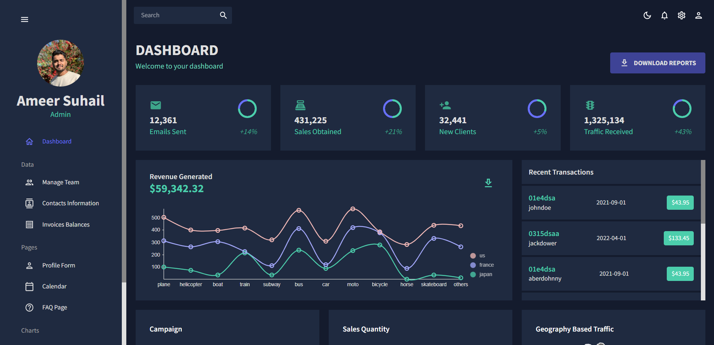

# Material UI Dashboard
A production grade dashboard built using React and MUI.
## Key Features
- Proper folder structure focusing on maintainablity 
- Used Nivo charts
- Implemented dark mode and light mode theme

### Screenhots:

 
 

 
 
